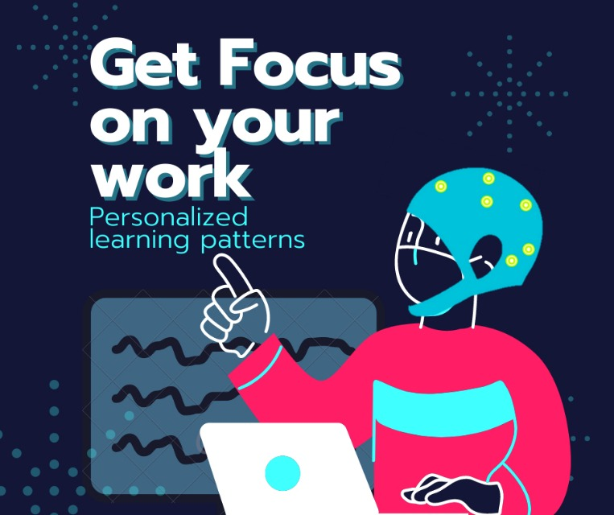

**Authors:** Mario De Lorenzo, Felix Maldonado Osorio

**Affiliation:** Drexel Hackathon 2022

**Date:** April 30 - May 1, 2022




# Table of Contents
- [Background](#Background)
- [Goal](#Goal)
- [Methods](#Methods)
- [Focus Tracker](#focus-tracker)
- [Applications](#Applications)
- [Future Work](#Future-Work)
- [Sources](#Sources)

## Background 

Staying focused is an important step in learning and succeeding in life. We all learn differently and what might work for somebody might not work for somebody else. There is a need for personalized learning patterns to understand the time and for how long everybody can stay focused. Current learning patterns rely on generalized methodologies, which recommend to take consistent breaks and compartmentalize active studying and breaks. Common techniques include the Pomodoro technique (insert hyperlink) and Desktime study (insert hyperlink). These techniques recommend one to take 5 or 17 minute study breaks after 25 or 52 minutes of studying, Pomodoro and Desktime respectively. With digital distractions being introduced by remote work, common study patterns may not work effectively and apply to everyone, leading to anxiety buildup and loss of information retention.

Brain-imaging techniques are a new technology that can detect neural activity. This technology allows for non-invasive and continuous readings from the brain. We propose a software solution to use an ```electroencephalography (EEG)``` device, a brain imaging technique, to detect focus levels and provide personalized learning patterns. This will ultimately improve the learning process of individuals and will improve their success in school and jobs.

## Goal
The goal of the project is to develop a signal processing pipeline that can be implemented into an inexpensive embedded system, such as a 
```Raspberry Pi``` and interface with any EEG device compatible with  ```Lab Streaming Layer (LSL)```. LSL is a network communications protocol that sends EEG data to network and allows for multiple clients to connect and collect streamed data. EEG is a popular brain-imaging tool used to detect electrical activity in the brain. Many EEG headsets are compatible with LSL, such as ```Unicorn Hybrid Black```([product](https://www.unicorn-bi.com/?gclid=Cj0KCQjwvLOTBhCJARIsACVldV1YNGgvgl_TGRFygCgsKmpA0AnJjArZZoUj_heLh7hWoNSNNysdkY8aAhaFEALw_wcB)) and  ```OpenBCI``` ([product](https://shop.openbci.com/collections/frontpage))

## Methods
This project utilizes EEG data and ```OpenVibe```, an open-source brain computer interface (BCI) software ([download](http://openvibe.inria.fr/downloads/)), to detect is subject is actively focused. 

EEG offers high temporal resolution (~1 ms) and relatively high spatial resolution (1-3 cm) for detecting surface or deep brain activation (SOURCE). 
For this project the team tested the processing pipeline with an ```8-channel``` Unicorn EEG with ```fs = 250 Hz ``` ([product](https://www.unicorn-bi.com/?gclid=Cj0KCQjwvLOTBhCJARIsACVldV1YNGgvgl_TGRFygCgsKmpA0AnJjArZZoUj_heLh7hWoNSNNysdkY8aAhaFEALw_wcB)) and connected to OpenVibe via LSL. Many EEG headsets are compatible with LSL, including the OpenBCI platforms. 

## focus-tracker
Develop an EEG platform and user-interface that allows 

## Applications

Atten

- Students: 
- Teaching efficiency: 
- Marketing: 
## Future Work
## Sources
[1]
[2] 

