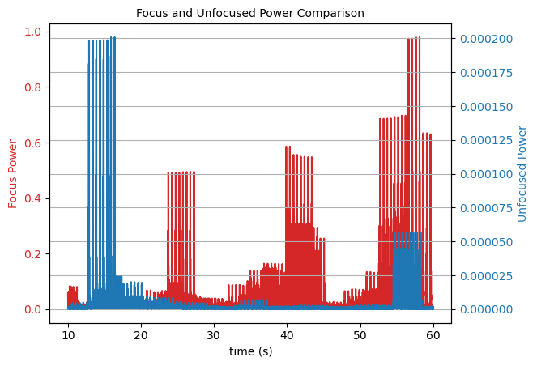

**Authors:** Mario De Lorenzo, Felix Maldonado Osorio, Emma Dryden

**Affiliation:** Drexel Hackathon 2022

**Date:** April 30 - May 1, 2022


# Table of Contents
- [Background](#Background)
- [Goal](#Goal)
- [Methods](#Methods)
- [System](#System)
- [Applications](#Applications)
- [Future Work](#Future-Work)
- [Sources](#Sources)

## Background 

Staying focused is an important step in learning and succeeding in life. We all learn differently and what might work for somebody might not work for somebody else. There is a need for personalized learning patterns to understand the time and for how long everybody can stay focused. Current learning patterns rely on generalized methodologies, which recommend to take consistent breaks and compartmentalize active studying and breaks. Common techniques include the Pomodoro technique (insert hyperlink) and Desktime study (insert hyperlink). These techniques recommend one to take 5 or 17 minute study breaks after 25 or 52 minutes of studying, Pomodoro and Desktime respectively. With digital distractions being introduced by remote work, common study patterns may not work effectively and apply to everyone, leading to anxiety buildup and loss of information retention.

Brain-imaging techniques are a new technology that can detect neural activity. This technology allows for non-invasive and continuous readings from the brain. We propose a software solution to use an ```electroencephalography (EEG)``` device, a brain imaging technique, to detect focus levels and provide personalized learning patterns. This will ultimately improve the learning process of individuals and will improve their success in school and jobs.

## Goal
The goal of the project is to develop a signal processing pipeline that can be implemented into an inexpensive embedded system, such as a 
```Raspberry Pi``` and interface with any EEG device compatible with  ```Lab Streaming Layer (LSL)```. LSL is a network communications protocol that sends EEG data to network and allows for multiple clients to connect and collect streamed data. EEG is a popular brain-imaging tool used to detect electrical activity in the brain. Many EEG headsets are compatible with LSL, such as ```Unicorn Hybrid Black```([product](https://www.unicorn-bi.com/?gclid=Cj0KCQjwvLOTBhCJARIsACVldV1YNGgvgl_TGRFygCgsKmpA0AnJjArZZoUj_heLh7hWoNSNNysdkY8aAhaFEALw_wcB)) and  ```OpenBCI``` ([product](https://shop.openbci.com/collections/frontpage))

## Methods
This project utilizes EEG data and ```OpenVibe```, an open-source brain computer interface (BCI) software ([download](http://openvibe.inria.fr/downloads/)), to detect is subject is actively focused. 

EEG offers high temporal resolution (~1 ms) and relatively high spatial resolution (1-3 cm) for detecting surface or deep brain activation (SOURCE). 
For this project the team tested the processing pipeline with an ```8-channel``` Unicorn EEG with ```fs = 250 Hz ``` ([product](https://www.unicorn-bi.com/?gclid=Cj0KCQjwvLOTBhCJARIsACVldV1YNGgvgl_TGRFygCgsKmpA0AnJjArZZoUj_heLh7hWoNSNNysdkY8aAhaFEALw_wcB)) and connected to OpenVibe via LSL. Many EEG headsets are compatible with LSL, including the OpenBCI platforms. 
# Results



## Applications

- Instructor-Student Engagement: Attention span in real-world classroom scenarios may be studied with EEG to gain a better understanding students' learning process after extended periods of time in different scenarios. Light-weight and non-invasive brain imaging may be used to understand the relationship between the learning environment, individual who is learning, or instructor to sustained attention. Research studies [https://www.frontiersin.org/articles/10.3389/fnhum.2017.00388/full] have proposed the implementation of EEG imaging to study alertness in classroom scenario. Long-term attention in children have yet to be studied in detail, introducing an opportunity to implement brain imaging with other behavioral analysis techniques to gain better understanding of how learning and attention work in a real-world environment. 
- Teaching Engagement:  
- Marketing: Behavior patterns in marketing have been widely used in supermarkets and retailers to study consumer behavioral patterns in order to tarket specific items by studying frequently traversed isled (in a supermarket, for example) or studying consumer eye movement to optimize item placement (such as chocolate in eye-level). Many studies rely on behavioral patterns, but have yet to introduce neural imaging to aid marketing research. There is strong evidence to support EEG brain imaging to highlight unconscious consumer behaviors for market research. [https://www.frontiersin.org/articles/10.3389/fnins.2020.594566/full]  
- 
## Future Work

Create a full app that people can install on their devices and use to get personalized learning patterns. Get more data in different scenarios (ex. studying with friends, listening to music, different time of the day and year, etc.). Quantify different levels of focus beyond visualization techniques, and improve real-time feedback to the user. 

## Sources

Ayaz, Hasan, et al. “Optical Brain Monitoring for Operator Training and Mental Workload Assessment.” NeuroImage, vol. 59, no. 1, Academic Press, Jan. 2012, pp. 36–47, doi:10.1016/J.NEUROIMAGE.2011.06.023.

Liu, Yichuan, et al. “Mental Workload Classification with Concurrent Electroencephalography and Functional Near-Infrared Spectroscopy.” Http://Dx.Doi.Org/10.1080/2326263X.2017.1304020, vol. 4, no. 3, Taylor & Francis, July 2017, pp. 175–85, doi:10.1080/2326263X.2017.1304020.

Liu, Yichuan, et al. “Multisubject ‘Learning’ for Mental Workload Classification Using Concurrent EEG, FNIRS, and Physiological Measures.” Frontiers in Human Neuroscience, vol. 11, Frontiers Media S. A, July 2017, p. 389, doi:10.3389/FNHUM.2017.00389/BIBTEX.

Saadati, Marjan, et al. “Application of Recurrent Convolutional Neural Networks for Mental Workload Assessment Using Functional Near-Infrared Spectroscopy.” Lecture Notes in Networks and Systems, vol. 259, Springer Science and Business Media Deutschland GmbH, 2021, pp. 106–13, doi:10.1007/978-3-030-80285-1_13.

